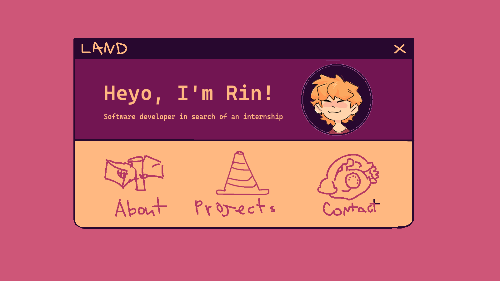

# Assignment - Functional Design Document for the Portfolio Project

1. Check if the functional requirements below are complete for your needs. If not, add or rewrite them.
2. Then work refine them and include drawings.

### Functional requirement

* The portfolio needs an intuitive navigation menu.
* The portfolio provides a timeline with the developer's educational and professional milestones.
* It needs a contact form to send messages directly to the developer's email
* The portfolio will showcase the developer’s skills and projects with detailed descriptions, and maybe extra information.
* In the projects section, mention Tools (e.g. Krita) and Dev tools (e.g. Webstorm/Unity) used. 
* Language/skills proficiency table must be included

### Non-functional requirement

* The portfolio should be responsive and accessible on different devices.
* The portfolio should be visually appealing and professional but also with personal touch of whimsy.
* The portfolio should load under two seconds.
* The portfolio should be secure and protect user data.
* The portfolio should be SEO optimized.
* The portfolio should be accessible to people with disabilities.
* The portfolio should have an option to switch to light/dark theme-modes.
* Funky little animations
* Funky little sounds
* The portfolio will not feature my full name, or a real picture of me.
    

---

sketches for initial design -> 

the last one had a lot of color variation and try-outs, but i will not add all 20 variatons here
there are more sketches to go
